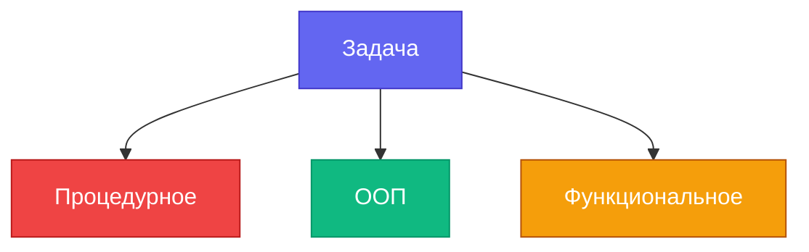
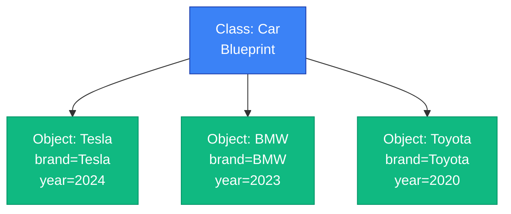

<style>
.slidev-code {
  @apply text-xs leading-tight;
  line-height: 1.3 !important;
}
.compact-code .slidev-code {
  @apply text-xs;
  line-height: 1.2 !important;
}
.slidev-code pre {
  padding: 0.5rem !important;
}
table {
  @apply text-xs;
  line-height: 1.2 !important;
}
table th, table td {
  padding: 0.25rem 0.5rem !important;
}
.compact-table table {
  @apply text-xs;
}
.compact-table th, .compact-table td {
  padding: 0.2rem 0.4rem !important;
}
</style>

# ООП в C++

## Часть 1: Основы и Инкапсуляция

<div class="grid grid-cols-3 gap-4 mt-8 text-sm text-left">

<div class="p-3 border border-white border-opacity-20 rounded">
  <div class="text-xs text-gray-400 mb-1">📚 Темы</div>
  Классы, объекты, инкапсуляция, конструкторы, деструкторы, RAII
</div>

<div class="p-3 border border-white border-opacity-20 rounded">
  <div class="text-xs text-gray-400 mb-1">⚡ Нужно знать</div>
  Функции, указатели, базовый синтаксис C++
</div>

<div class="p-3 border border-white border-opacity-20 rounded">
  <div class="text-xs text-gray-400 mb-1">⏱️ Время</div>
  ~90 минут + практика
</div>

</div>

<div class="pt-8">
  <span @click="$slidev.nav.next" class="px-2 py-1 rounded cursor-pointer" hover="bg-white bg-opacity-10">
    Начать <carbon:arrow-right class="inline"/>
  </span>
</div>

---
layout: two-cols
---

# Парадигмы программирования

Разные подходы к решению одних и тех же задач



<div class="mt-4 text-sm text-gray-400">
Каждый подход — разный способ думать о коде
</div>

::right::

<v-clicks>

**Процедурное программирование**
- Функции + данные отдельно
- Логика разбита на процедуры
- Глобальное состояние

**ООП**
- Объекты = данные + поведение
- Инкапсуляция состояния
- Моделирование реального мира

**Функциональное**
- Чистые функции
- Иммутабельность
- Композиция

</v-clicks>

---

# Почему ООП?

````md magic-move {lines: true}
```cpp
// ❌ Процедурный подход — данные и логика разделены
struct BankAccount {
    double balance;
    string owner;
};

void deposit(BankAccount& acc, double amount) {
    acc.balance += amount; // Кто угодно может изменить!
}

void withdraw(BankAccount& acc, double amount) {
    acc.balance -= amount; // Нет валидации — можно уйти в минус
}

int main() {
    BankAccount acc;
    acc.balance = -9999; // 😱 Никто не остановит!
}
```

```cpp
// ✅ ООП — данные и логика вместе, доступ контролируется
class BankAccount {
private:
    double balance = 0; // Снаружи не достать
    string owner;
public:
    void deposit(double amount) {
        if (amount > 0) balance += amount;
    }
    bool withdraw(double amount) {
        if (amount > 0 && amount <= balance) {
            balance -= amount;
            return true;
        }
        return false; // Уйти в минус — невозможно
    }
    double getBalance() const { return balance; }
};
```
````

<v-click at="2">

<div class="mt-3 p-3 bg-green-500 bg-opacity-10 rounded text-sm">

✅ **Результат:** данные защищены, логика инкапсулирована, ошибки невозможны

</div>

</v-click>

---
layout: center
---

# Три кита ООП

<div class="grid grid-cols-3 gap-4 mt-8">
<v-clicks>

<div class="text-center p-4 border-2 border-blue-500 rounded">
  <div class="text-4xl mb-2">🔒</div>
  <h3>Инкапсуляция</h3>
  <p class="text-sm">Скрываем детали</p>
</div>

<div class="text-center p-4 border-2 border-green-500 rounded">
  <div class="text-4xl mb-2">🧬</div>
  <h3>Наследование</h3>
  <p class="text-sm">Переиспользуем код</p>
</div>

<div class="text-center p-4 border-2 border-purple-500 rounded">
  <div class="text-4xl mb-2">🎭</div>
  <h3>Полиморфизм</h3>
  <p class="text-sm">Много форм</p>
</div>

</v-clicks>
</div>

---

# Объекты в реальном мире

<div class="grid grid-cols-2 gap-6">

<div>

<div v-click>

**Телефон**
- Свойства: цвет, модель, заряд
- Поведение: звонить(), отправитьСМС()
- Скрытое: как работает процессор

</div>

<div v-click class="compact-code mt-3">

```cpp
class Phone {
private:
    string model;   // свойства
    int battery;    // скрытое состояние
public:
    void call(string number);   // поведение
    void sendSMS(string text);
    int getBattery() const { return battery; }
};
```

</div>

</div>

<div>

<div v-click>

**Банковская карта**
- Свойства: номер, баланс, владелец
- Поведение: оплатить(), снятьНаличные()
- Скрытое: пин-код, алгоритмы шифрования

</div>

<div v-click class="compact-code mt-3">

```cpp
class BankCard {
private:
    string number;  // свойства
    double balance;
    string pinHash; // скрытое — никогда не открывать!
public:
    bool pay(double amount);    // поведение
    bool checkPin(string pin);
};
```

</div>

</div>

</div>

<v-click>

<div class="mt-4 p-3 bg-blue-500 bg-opacity-10 rounded text-sm">

💡 **Ключевая идея**: объект = данные + методы + скрытые детали реализации

</div>

</v-click>

---

# Класс vs Объект

<div class="grid grid-cols-2 gap-4">

<div>

**Класс** — это чертёж, шаблон

<div class="compact-code">

```cpp
class Car {
    string brand;
    int year;
    void start() {
        // логика запуска
    }
};
```

</div>

Класс описывает:
- Какие данные будут
- Какие операции возможны

</div>

<div>



<div class="text-sm mt-2">
📐 Класс = форма<br/>
🏠 Объект = конкретный экземпляр
</div>

</div>

</div>

---

# Структуры vs Классы

<div class="compact-code">

```cpp
// struct — всё public по умолчанию
struct Point {
    int x;  // public
    int y;  // public
    void print() { cout << x << " " << y; } // можно!
};

// class — всё private по умолчанию
class PointClass {
    int x;  // private
    int y;  // private
    void print() { cout << x << " " << y; } // тоже можно!
};
```

</div>

<v-click>

<div class="compact-table">

| | struct | class |
|-|--------|-------|
| **Доступ по умолчанию** | 🟢 public | 🔴 private |
| **Методы** | ✅ Можно | ✅ Можно |
| **Конструкторы** | ✅ Можно | ✅ Можно |
| **Отличие** | Только дефолтный доступ |  |

</div>

</v-click>

<v-click>

<div class="p-2 bg-blue-500 bg-opacity-10 rounded text-xs mt-2">

💡 В C++ `struct` и `class` идентичны — разница лишь в одном слове: доступ по умолчанию.<br/>
На практике: `struct` для простых данных без логики, `class` — когда нужна инкапсуляция.

</div>

</v-click>

---

# Первый класс

````md magic-move {lines: true}
```cpp
// ❌ Всё private — использовать нельзя
class Rectangle {
    double width;
    double height;
    double area() {
        return width * height;
    }
    double perimeter() {
        return 2 * (width + height);
    }
};
```

```cpp
// ✅ Разделяем данные и интерфейс
class Rectangle {
private:
    double width;   // Скрыто — реализация
    double height;

public:
    Rectangle(double w, double h) : width(w), height(h) {}

    double area() const {           // Открыто — интерфейс
        return width * height;
    }
    double perimeter() const {
        return 2 * (width + height);
    }
};
```
````

<v-click at="2">

<div class="mt-3 p-3 bg-blue-500 bg-opacity-10 rounded text-sm">

💡 **Правило:** поля — `private`, методы для использования — `public`

</div>

</v-click>

---

# Члены класса: поля

<div class="compact-code">

```cpp
class Student {
    string name;
    int age;
    double gpa;
    vector<string> courses;
    bool isEnrolled = true;  // C++11+
    int semester = 1;
};
```

</div>

<v-click>

**Поля** — данные объекта
- У каждого объекта свои значения
- Любой тип (примитивы, объекты, контейнеры)

</v-click>

---

# Члены класса: методы

<div class="compact-code">

```cpp
class Calculator {
private:
    double result = 0;      // Данные — скрыты

public:
    void add(double x)      { result += x; }
    void multiply(double x) { result *= x; }
    double getResult() const { return result; }
    void reset()            { result = 0; }
};

int main() {
    Calculator c;
    c.add(10);
    c.multiply(3);
    cout << c.getResult(); // 30
}
```

</div>

<v-click>

**Методы** — функции, работающие с данными объекта
- Доступ ко всем полям класса
- Определяют поведение объекта

</v-click>

---

# Создание объектов

<div class="compact-code">

```cpp
class Point {
public:
    int x = 0, y = 0;
    void print() { cout << "(" << x << ", " << y << ")\n"; }
};

int main() {
    Point p1;           // Создание на стеке
    p1.x = 10;          // Доступ к полю через точку
    p1.y = 20;
    p1.print();         // Вызов метода
}
```

</div>

<v-click>

**Стек vs Куча:**
- Стек: автоматическое управление памятью
- Куча: ручное управление через `new`/`delete`

</v-click>

---

# Создание в куче

<div class="compact-code">

```cpp
int main() {
    // Создание в куче
    Point* p2 = new Point();
    p2->x = 5;
    p2->y = 10;
    p2->print();
    delete p2;
    
    // Умные указатели (C++11+)
    auto p3 = std::make_unique<Point>();
    p3->x = 15;
    p3->y = 20;
}
```

</div>

<v-click>

<div class="compact-table">

| | Stack | Heap |
|-|-------|------|
| **Создание** | `Point p;` | `new Point()` |
| **Доступ** | `.` | `->` |
| **Управление** | Авто | Ручное |
| **Скорость** | ⚡ Быстрая аллокация | 🐢 Медленнее аллокация |
| **Lifetime** | До scope | До delete |

</div>

</v-click>

<v-click>

<div class="p-2 bg-yellow-500 bg-opacity-20 rounded text-xs mt-2">

⚠️ Используй `unique_ptr`/`shared_ptr` вместо `new`/`delete`

</div>

</v-click>

---

# Доступ к членам

<div class="grid grid-cols-2 gap-4">

<div>

<v-clicks>

**Через точку (.) для объектов**

```cpp
Point p;
p.x = 10;
p.y = 20;
p.print();

vector<Point> points;
points[0].x = 5;
```

</v-clicks>

</div>

<div>

<v-clicks>

**Через стрелку (->) для указателей**

```cpp
Point* ptr = new Point();
ptr->x = 10;
ptr->y = 20;
ptr->print();

// Или так:
(*ptr).x = 10;  // Громоздко
```

</v-clicks>

</div>

</div>

<v-click>

<div class="mt-4 p-4 bg-blue-500 bg-opacity-10 rounded">

💡 **Внутри методов класса** можно обращаться к полям напрямую без `this->`

</div>

</v-click>

---

# Указатель `this`

<div class="grid grid-cols-2 gap-4">

<div class="compact-code">

```cpp
class Person {
    string name;
    int age;
public:
    // Конфликт имён: параметр = поле
    void setName(string name) {
        this->name = name; // this-> убирает неоднозначность
    }

    // Цепочка вызовов (method chaining)
    Person& setAge(int age) {
        this->age = age;
        return *this; // Возвращаем сам объект
    }

    void print() const {
        cout << name << ", " << age;
    }
};
```

</div>

<div>

<v-click>

<div class="p-3 bg-blue-500 bg-opacity-20 rounded text-sm mb-3">

💡 **`this`** — указатель на текущий объект.<br/>
Всегда доступен внутри нестатических методов.

</div>

</v-click>

<v-click>

```cpp
int main() {
    Person p;
    // Method chaining:
    p.setAge(25).print();
    // → работает, т.к. setAge возвращает *this
}
```

</v-click>

<v-click>

<div class="p-3 bg-green-500 bg-opacity-20 rounded text-sm mt-3">

✅ Когда нужен `this->`:
- Параметр называется так же, как поле
- Method chaining (`return *this`)
- Передать себя в другую функцию

</div>

</v-click>

</div>

</div>

---
layout: center
---

# 🧩 Мини-задание

<div class="mt-6 text-left max-w-xl mx-auto">

Напиши класс `Timer`:

<div class="compact-code mt-4">

```cpp
class Timer {
    // Твой код здесь
};

// Должно работать так:
int main() {
    Timer t(60);   // 60 секунд
    t.tick();      // -1 секунда
    t.tick();
    cout << t.remaining(); // 58
    cout << t.isExpired(); // false
}
```

</div>

</div>

<v-click>

<div class="mt-6 p-4 bg-indigo-500 bg-opacity-10 rounded text-sm max-w-xl mx-auto">

💡 **Подсказка:** поле `seconds` должно быть `private`. Не забудь про валидацию в конструкторе и `tick()`.

</div>

</v-click>

---

# Инкапсуляция

<div class="text-6xl mb-8">🔒</div>

## Скрываем то, что не должно быть доступно снаружи

<v-click>

<div class="text-xl mt-8 border-l-4 border-indigo-500 pl-6 italic text-gray-300">
"Показывай только то, что нужно.<br/>
Прячь то, <em>как</em> это работает."
</div>

</v-click>

---

# Зачем скрывать данные?

<div class="grid grid-cols-2 gap-3">

<div class="compact-code">

<div v-click="1">

```cpp
class BankAccount {
public:
    double balance;  // Все могут менять!
};

int main() {
    BankAccount acc;
    acc.balance = 1000;
    
    acc.balance = -500;        // 😱
    acc.balance = 999999999;   // 😱
    acc.balance = 0;           // 😱
}
```

</div>

</div>

<div>

<div v-click="2">

<div class="p-3 bg-red-500 bg-opacity-20 rounded text-sm mb-2">

❌ **Проблемы:**
- Нет контроля над данными
- Невозможно гарантировать корректность
- Ошибки проявятся где-то потом

</div>

</div>

<div v-click="3">

<div class="p-3 bg-yellow-500 bg-opacity-20 rounded text-sm mb-2">

⚠️ **Реальный пример:**
Knight Capital, 2012: некорректное состояние системы из-за отсутствия контроля над данными → **$440 млн убытка за 45 минут**

</div>

</div>

<div v-click="4">

<div class="p-3 bg-green-500 bg-opacity-20 rounded text-sm">

✅ **Решение:**
Инкапсуляция + валидация через методы

</div>

</div>

</div>

</div>

---

# Спецификаторы доступа

<div class="grid grid-cols-2 gap-4">

<div class="compact-code">

```cpp
class MyClass {
private:
    int secretData;
    void helperMethod();
protected:
    int protectedData;
public:
    int publicData;
    void publicMethod();
};
```

</div>

<div>

<div class="text-center mb-4 text-sm">Кто имеет доступ?</div>

<div class="p-3 bg-red-500 bg-opacity-20 rounded mb-2 text-xs">
<div class="font-bold mb-1">🔴 private</div>
✅ Только сам класс<br/>
❌ Наследники<br/>
❌ Внешний код
</div>

<div class="p-3 bg-yellow-500 bg-opacity-20 rounded mb-2 text-xs">
<div class="font-bold mb-1">🟡 protected</div>
✅ Сам класс<br/>
✅ Наследники<br/>
❌ Внешний код
</div>

<div class="p-3 bg-green-500 bg-opacity-20 rounded text-xs">
<div class="font-bold mb-1">🟢 public</div>
✅ Сам класс<br/>
✅ Наследники<br/>
✅ Внешний код
</div>

</div>

</div>

<v-click>

<div class="p-2 bg-blue-500 bg-opacity-10 rounded text-xs mt-3">

💡 По умолчанию в class всё private, в struct - public

</div>

</v-click>

---

# Плохо → Хорошо: Инкапсуляция

<div class="grid grid-cols-2 gap-3">

<div>

````md magic-move {lines: true}
```cpp
// ❌ БЕЗ инкапсуляции
class User {
public:
    string password;
    int age;
    string email;
};

int main() {
    User user;
    user.password = "12345";
    user.age = -5;
    user.email = "не email";
    cout << user.password;
    user.age = 200;
}
```

```cpp
// ✅ С инкапсуляцией
class User {
private:
    string passwordHash;
    int age;
    string email;
public:
    void setPassword(const string& pwd) {
        passwordHash = hashFunction(pwd);
    }
    bool checkPassword(const string& pwd) {
        return passwordHash == hashFunction(pwd);
    }
    void setAge(int newAge) {
        if (newAge >= 0 && newAge <= 150)
            age = newAge;
        else
            throw invalid_argument("Invalid age");
    }
    int getAge() const { return age; }
};
```
````

</div>

<div>

<div v-click="1" class="p-2 bg-red-500 bg-opacity-20 rounded text-xs mb-2">

❌ Проблемы:
- Прямой доступ к данным
- Нет валидации
- Утечки информации

</div>

<div v-click="2" class="p-2 bg-green-500 bg-opacity-20 rounded text-xs mb-2">

✅ Решение:
- Приватные поля
- Валидация в сеттерах
- Хэширование пароля

</div>

<div v-click="2" class="p-2 bg-blue-500 bg-opacity-20 rounded text-xs">

💡 Результат:
- Гарантия корректности ✓
- Безопасность данных ✓
- Контроль доступа ✓

</div>

</div>

</div>

---

# Геттеры и сеттеры

<div class="grid grid-cols-2 gap-3">

<div class="text-sm">

**Зачем нужны?**

- Контроль изменений
- Валидация данных
- Вычисляемые свойства
- Логирование

<div class="compact-code mt-2">

```cpp
void setBalance(double b) {
    if (b < 0)
        throw invalid_argument(
            "Negative balance"
        );
    balance = b;
}
```

</div>

</div>

<div class="compact-code">

**Паттерн**

```cpp
class Person {
private:
    string name;
    int age;
public:
    string getName() const {
        return name;
    }
    void setName(const string& n) {
        if (!n.empty())
            name = n;
    }
    int getAge() const {
        return age;
    }
    void setAge(int a) {
        if (a >= 0 && a <= 150)
            age = a;
    }
};
```

</div>

</div>

---

# Best Practices: геттеры/сеттеры

<div class="compact-code">

**✅ Геттеры const**
```cpp
int getAge() const { return age; }
```

**✅ Передавай по const ссылке**
```cpp
void setName(const string& name) { /* ... */ }
```

**✅ Смысловые имена с логикой**
```cpp
void deposit(double amount);   // Лучше чем setBalance
void withdraw(double amount);
```

**❌ Не делай для всего подряд**
- Нужен только getter? → Может, readonly?
- Нужны оба без логики? → Может, public?

</div>

---

# Inline геттеры и const

<div class="grid grid-cols-2 gap-3">

<div>

<div class="p-2 bg-blue-500 bg-opacity-20 rounded text-xs mb-2">

💡 Почему inline?

</div>

<div class="compact-code">

```cpp
class Person {
    string name;
    int id;
public:
    // Inline - определение в классе
    string getName() const { 
        return name; 
    }
    int getId() const { 
        return id; 
    }
};
```

</div>

Преимущества:
- Компилятор может оптимизировать
- Нет накладных расходов на вызов
- Для простых геттеров - быстрее

</div>

<div>

<div class="p-2 bg-green-500 bg-opacity-20 rounded text-xs mb-2">

✅ Почему const?

</div>

<div class="compact-code">

```cpp
class Point {
    int x, y;
public:
    int getX() const { return x; }
    int getY() const { return y; }
};

void print(const Point& p) {
    cout << p.getX();  // OK
    cout << p.getY();  // OK
}
```

</div>

Без const:
- Нельзя вызвать у const объекта
- Компилятор считает метод небезопасным
- Ошибка компиляции!

</div>

</div>

<v-click>

<div class="p-2 bg-yellow-500 bg-opacity-20 rounded text-xs mt-2">

⚠️ const = обещание не менять объект. Компилятор следит за выполнением!

</div>

</v-click>

---
layout: center
---

# Конструкторы

<div class="text-6xl mb-8">🏗️</div>

## Инициализация объекта при создании

<v-click>

<div class="text-xl mt-8">
Без конструктора объект рождается в неопределённом состоянии
</div>

</v-click>

---

# Зачем нужны конструкторы?

<div class="compact-code">

```cpp
class Rectangle {
private:
    double width, height;
public:
    double area() { return width * height; }
};

int main() {
    Rectangle r;
    cout << r.area();  // Мусор из памяти!
}
```

</div>

<v-click>

**Проблема:** поля не инициализированы → некорректное состояние

**Решение:** конструктор гарантирует корректность при создании

</v-click>

---

# Конструктор по умолчанию

<div class="grid grid-cols-2 gap-3">

<div class="compact-code">

````md magic-move {lines: true}
```cpp
// Явный конструктор
class Point {
private:
    int x, y;
public:
    Point() {
        x = 0;
        y = 0;
    }
    void print() { 
        cout << "(" << x << ", " << y << ")\n"; 
    }
};
```

```cpp
// Современный способ — = default (C++11)
class Point {
private:
    int x = 0; // инициализация прямо в поле
    int y = 0;
public:
    Point() = default; // явно просим компилятор
    void print() { 
        cout << "(" << x << ", " << y << ")\n"; 
    }
};
```
````

</div>

<div>

<div v-click="1" class="p-3 bg-blue-500 bg-opacity-20 rounded text-sm mb-2">

💡 **Когда вызывается?**
- При создании без аргументов
- `Point p;` или `Point p{};`

</div>

<div v-click="2" class="p-3 bg-green-500 bg-opacity-20 rounded text-sm mb-2">

✅ **`= default`**
Явно говорим компилятору: "сгенерируй стандартный". Работает даже когда есть другие конструкторы.

</div>

<div v-click="2" class="p-3 bg-yellow-500 bg-opacity-20 rounded text-sm">

⚠️ **Важно!**
Если добавить конструктор с параметрами, автогенерация отключается — используй `= default`

</div>

</div>

</div>

---

# Конструктор с параметрами

````md magic-move {lines: true}
```cpp
// Шаг 1: Базовый конструктор
class Rectangle {
private:
    double width, height;
public:
    Rectangle(double w, double h) {
        width = w;
        height = h;
    }
    double area() const { return width * height; }
};
```

```cpp
// Шаг 2: Добавляем валидацию
class Rectangle {
private:
    double width, height;
public:
    Rectangle(double w, double h) {
        if (w > 0 && h > 0) {
            width = w;
            height = h;
        } else {
            throw invalid_argument("Dimensions must be positive");
        }
    }
    double area() const { return width * height; }
};
```

```cpp
// Шаг 3: Список инициализации
class Rectangle {
private:
    double width, height;
public:
    Rectangle(double w, double h) : width(w), height(h) {
        if (w <= 0 || h <= 0) {
            throw invalid_argument("Dimensions must be positive");
        }
    }
    double area() const { return width * height; }
};
```
````

<v-click at="3">

<div class="p-2 bg-green-500 bg-opacity-20 rounded text-xs mt-2">

✅ **Финальная версия:** список инициализации + валидация

</div>

</v-click>

---

# Список инициализации

<div class="grid grid-cols-2 gap-3">

<div>

````md magic-move {lines: true}
```cpp
// ❌ Старый способ
class Student {
    string name;
    int age;
    double gpa;
public:
    Student(string n, int a, double g) {
        name = n;  // Присваивание
        age = a;
        gpa = g;
    }
};
```

```cpp
// ✅ Современный способ
class Student {
    string name;
    int age;
    double gpa;
public:
    Student(string n, int a, double g)
        : name(n), age(a), gpa(g)  // Инициализация
    {
    }
};
```
````

</div>

<div>

<div v-click="1" class="p-2 bg-red-500 bg-opacity-20 rounded text-xs mb-2">

❌ Старый способ:
```
1. Default constructor
2. Assignment operator
Два действия!
```

</div>

<div v-click="2" class="p-2 bg-green-500 bg-opacity-20 rounded text-xs mb-2">

✅ Новый способ:
```
1. Copy constructor
Одно действие!
```

</div>

<div v-click="2" class="p-2 bg-blue-500 bg-opacity-20 rounded text-xs">

💡 Когда обязателен:
- const поля
- Ссылки
- Объекты без default конструктора

</div>

</div>

</div>

---

# Список инициализации: детали

<div class="compact-code">

```cpp
class Student {
    const int id;       // const — нельзя присвоить в теле
    string name;
    double gpa;
    vector<int> grades;
public:
    Student(int studentId, string n, double g)
        : id(studentId),     // const: только через список
          name(n),
          gpa(g),
          grades{}           // инициализируем пустым вектором
    {
        // id = 10; // ❌ Ошибка! const уже инициализирован
    }
};
```

</div>

<v-click>

<div class="grid grid-cols-2 gap-3 mt-3">

<div class="p-2 bg-yellow-500 bg-opacity-20 rounded text-xs">

⚠️ **Когда список обязателен:**
- `const` поля
- Объекты без конструктора по умолчанию

</div>

<div class="p-2 bg-blue-500 bg-opacity-20 rounded text-xs">

💡 **Порядок инициализации** = порядок объявления полей в классе, не порядок в списке

</div>

</div>

</v-click>

---

# Конструктор копирования

<div class="compact-code">

```cpp
class Array {
    int* data;
    size_t size;
public:
    Array(size_t s) : size(s) {
        data = new int[size];
    }
    Array(const Array& other) : size(other.size) {
        data = new int[size];
        for (size_t i = 0; i < size; ++i)
            data[i] = other.data[i];
    }
    ~Array() { delete[] data; }
};

int main() {
    Array arr1(10);
    Array arr2 = arr1;  // Конструктор копирования
    Array arr3(arr1);   // Тоже конструктор копирования
}
```

</div>

---

# Деструктор

<div class="grid grid-cols-2 gap-3">

<div class="compact-code">

```cpp
class FileHandler {
    FILE* file;
    string filename;
public:
    FileHandler(const string& fname) 
        : filename(fname) 
    {
        file = fopen(fname.c_str(), "w");
        cout << "Opened: " << filename << "\n";
    }
    ~FileHandler() {
        if (file) fclose(file);
        cout << "Closed: " << filename << "\n";
    }
    void write(const string& data) {
        fprintf(file, "%s", data.c_str());
    }
};
```

</div>

<div>

<v-click>

<div class="p-3 bg-gray-800 text-green-400 rounded text-sm font-mono">

**Output:**
```
Opened: log.txt
Closed: log.txt
```

</div>

</v-click>

<v-click>

<div class="mt-3 p-3 bg-blue-500 bg-opacity-10 rounded text-sm">

💡 **RAII pattern**<br/>
Resource Acquisition Is Initialization
- Конструктор открывает ресурс
- Деструктор автоматически закрывает
- Никаких утечек!

</div>

</v-click>

</div>

</div>

---

# Когда вызываются деструкторы?

<div class="compact-code">

```cpp
class Demo {
    string name;
public:
    Demo(string n) : name(n) { cout << "Ctor: " << name << "\n"; }
    ~Demo() { cout << "Dtor: " << name << "\n"; }
};

void function() {
    Demo local("Local");  // Dtor при выходе из функции
}

int main() {
    Demo global("Global");
    {
        Demo scoped("Scoped");  // Dtor здесь
    }
    Demo* heap = new Demo("Heap");
    delete heap;  // Dtor вызываем вручную
    function();
    // Dtor global вызовется в конце main
}
```

</div>

---

# Жизненный цикл объекта


<div class="mt-4 p-3 bg-blue-500 bg-opacity-10 rounded text-sm">

💡 **Деструктор вызывается автоматически** при выходе из scope или delete

</div>

---

# Rule of Three

<div class="grid grid-cols-2 gap-3">

<div>

<div class="p-3 bg-yellow-500 bg-opacity-20 rounded text-sm mb-2">

⚠️ **Если нужен один - нужны все три:**

1. **Деструктор** - освобождает ресурсы
2. **Copy constructor** - копирует ресурсы
3. **Copy assignment** - присваивание

</div>

<div class="compact-code">

```cpp
class Buffer {
    char* data;
    size_t size;
public:
    ~Buffer() {                    // 1
        delete[] data;
    }
    Buffer(const Buffer& other);   // 2
    Buffer& operator=(              // 3
        const Buffer& other
    );
};
```

</div>

</div>

<div>

<div v-click class="p-3 bg-red-500 bg-opacity-20 rounded text-sm mb-2">

❌ **Без Rule of Three:**
```
Buffer b1;
Buffer b2 = b1;  // Shallow copy!
// Деструкторы освободят 
// одну память дважды!
// 💥 Crash!
```

</div>

<div v-click class="p-3 bg-green-500 bg-opacity-20 rounded text-sm">

✅ **С Rule of Three:**
```
Buffer b1;
Buffer b2 = b1;  // Deep copy
// Каждый управляет 
// своей памятью
// ✅ Работает!
```

</div>

</div>

</div>

---

# Rule of Five (C++11)

<div class="grid grid-cols-2 gap-3">

<div>

<div class="p-3 bg-blue-500 bg-opacity-20 rounded text-sm mb-2">

🚀 **Rule of Three + Move семантика:**

4. **Move constructor** - перемещает ресурсы
5. **Move assignment** - перемещает при присваивании

</div>

<div class="compact-code">

```cpp
class Buffer {
    char* data;
public:
    // Rule of Three
    ~Buffer();
    Buffer(const Buffer& other);
    Buffer& operator=(const Buffer& other);
    
    // + Move семантика
    Buffer(Buffer&& other) noexcept;        // 4
    Buffer& operator=(Buffer&&) noexcept;   // 5
};
```

</div>

</div>

<div>

<div v-click class="p-3 bg-purple-500 bg-opacity-20 rounded text-sm mb-2">

💡 **Зачем Move?**
```cpp
Buffer createBuffer() {
    Buffer b(1000);
    return b;  // Move вместо Copy!
}
```
- Copy: дублирование данных
- Move: передача владения
- В 10-100 раз быстрее!

</div>

<div v-click class="p-3 bg-green-500 bg-opacity-20 rounded text-sm">

✅ **Modern C++ Best Practice**
Всегда реализуй Rule of Five для классов с ресурсами

</div>

</div>

</div>

---
layout: center
---

# Модульность

<div class="text-6xl mb-8">📦</div>

## Разделение интерфейса и реализации

<v-click>

<div class="text-xl mt-8">
Объявление отдельно, реализация отдельно
</div>

</v-click>

---

# Зачем разделять?

<v-clicks>

**Проблема монолита:**
```cpp
// Всё в одном файле - 5000 строк кода
class DatabaseManager { /* 1000 строк */ };
class UserService { /* 800 строк */ };
class PaymentProcessor { /* 1200 строк */ };
// ... ещё 20 классов
```

**Преимущества разделения:**
- ✅ Быстрая компиляция (компилируются только изменённые файлы)
- ✅ Чистый интерфейс (в .h видно только API)
- ✅ Скрытие реализации (детали в .cpp)
- ✅ Переиспользование (подключил .h - использовал класс)
- ✅ Параллельная разработка (разные люди - разные файлы)

</v-clicks>

---

# Header файлы (.h)

<div class="grid grid-cols-2 gap-3">

<div class="compact-code">

**Rectangle.h**

```cpp
#ifndef RECTANGLE_H
#define RECTANGLE_H

class Rectangle {
private:
    double width;
    double height;
public:
    Rectangle(double w, double h);
    double area() const;
    double perimeter() const;
    void setWidth(double w);
    void setHeight(double h);
};

#endif
```

</div>

<div class="text-sm">

**Что в header:**
- Объявление класса
- Объявления методов
- Поля класса
- Include guards

**Что НЕ в header:**
- ❌ Реализация методов
- ❌ using namespace
- ❌ Глобальные переменные

<div class="p-2 bg-blue-500 bg-opacity-20 rounded mt-2 text-xs">

💡 Header = контракт (что умеет, не как)

</div>

</div>

</div>

---

# Source файлы (.cpp)

<div class="compact-code">

```cpp
#include "Rectangle.h"
#include <stdexcept>

Rectangle::Rectangle(double w, double h) : width(w), height(h) {
    if (w <= 0 || h <= 0)
        throw std::invalid_argument("Dimensions must be positive");
}

double Rectangle::area() const {
    return width * height;
}

double Rectangle::perimeter() const {
    return 2 * (width + height);
}

void Rectangle::setWidth(double w) {
    if (w > 0) width = w;
}
```

</div>

---

# Include Guards vs #pragma once

<div class="grid grid-cols-2 gap-3">

<div class="compact-code">

**Традиционный**

```cpp
// Rectangle.h
#ifndef RECTANGLE_H
#define RECTANGLE_H

class Rectangle {
    // ...
};

#endif
```

</div>

<div class="compact-code">

**Современный**

```cpp
// Rectangle.h
#pragma once

class Rectangle {
    // ...
};
```

</div>

</div>

<v-click>

<div class="compact-table">

| | #ifndef | #pragma once |
|-|---------|--------------|
| **Строк** | 3 лишние | 1 строка |
| **Скорость** | Медленнее | ⚡ Быстрее |
| **Ошибки** | Возможны | Нет |
| **Поддержка** | 100% | 99.9% |

</div>

</v-click>

<v-click>

<div class="p-2 bg-green-500 bg-opacity-20 rounded text-xs mt-2">

✅ Используй `#pragma once` в современных проектах

</div>

</v-click>

---

# Структура проекта

<div class="compact-code">

```
MyProject/
├── include/
│   ├── BankAccount.h
│   ├── Transaction.h
│   └── Customer.h
├── src/
│   ├── BankAccount.cpp
│   ├── Transaction.cpp
│   └── Customer.cpp
├── main.cpp
└── CMakeLists.txt
```

</div>

<v-click>

<div class="compact-code">

**main.cpp**

```cpp
#include "BankAccount.h"
#include "Customer.h"

int main() {
    Customer customer("John Doe", 12345);
    BankAccount account(customer, 1000.0);
    account.deposit(500);
    account.withdraw(200);
    return 0;
}
```

</div>

</v-click>

---

# Пример: класс BankAccount

<div class="compact-code">

**BankAccount.h**

```cpp
#pragma once
#include <string>

class BankAccount {
private:
    std::string owner;
    std::string accountNumber;
    double balance;
    bool isValidAmount(double amount) const;
public:
    BankAccount(const std::string& owner, 
                const std::string& accNum);
    void deposit(double amount);
    bool withdraw(double amount);
    double getBalance() const;
    void transfer(BankAccount& target, double amount);
    std::string getAccountInfo() const;
};
```

</div>

---

# BankAccount - реализация

<div class="compact-code">

```cpp
#include "BankAccount.h"
#include <stdexcept>

BankAccount::BankAccount(const std::string& owner, 
                         const std::string& accNum)
    : owner(owner), accountNumber(accNum), balance(0.0) {}

bool BankAccount::isValidAmount(double amount) const {
    return amount > 0 && amount < 1000000;
}

void BankAccount::deposit(double amount) {
    if (!isValidAmount(amount))
        throw std::invalid_argument("Invalid amount");
    balance += amount;
}

bool BankAccount::withdraw(double amount) {
    if (!isValidAmount(amount) || amount > balance)
        return false;
    balance -= amount;
    return true;
}
```

</div>

---

# Пример: класс Student

<div class="compact-code">

```cpp
#pragma once
#include <string>
#include <vector>

class Student {
private:
    std::string name;
    int id;
    std::vector<double> grades;
public:
    Student(const std::string& name, int id);
    void addGrade(double grade);
    double getAverageGrade() const;
    bool isPassing() const;  // >= 60
    std::string getName() const { return name; }
    int getId() const { return id; }
    void printReport() const;
};
```

</div>

<v-click>

<div class="p-3 bg-blue-500 bg-opacity-10 rounded mt-2 text-sm">

✨ **Хорошо:** инкапсуляция, inline геттеры, смысловые методы

</div>

</v-click>

---

# Best Practices: Организация

<div class="compact-code">

**✅ Один класс - один файл**
```
User.h + User.cpp
Product.h + Product.cpp
```

**✅ Используй #pragma once**
```cpp
#pragma once  // Вместо include guards
```

**✅ Используй const для методов-читателей**
```cpp
double getBalance() const;  // Не меняет объект
```

</div>

---

# Best Practices: Код

<div class="compact-code">

**✅ Передавай сложные типы по const ссылке**
```cpp
void setName(const std::string& name);  // Не копируем
```

**✅ Инициализируй через список инициализации**
```cpp
Student(string n, int i) : name(n), id(i) {}
```

**✅ Валидируй данные в сеттерах**
```cpp
void setAge(int a) {
    if (a >= 0 && a <= 150) age = a;
}
```

</div>

---
layout: two-cols
---

# Найди ошибки #1

```cpp
class Rectangle {
    double width, height;
    
    Rectangle(double w, double h) {
        width = w;
        height = h;
    }
    
    double area() {
        return width * height;
    }
};

int main() {
    Rectangle r(10, 5);
    cout << r.area();
}
```

::right::

<v-click>

**Ошибки:**

1. Конструктор private - нельзя создать объект
2. Метод area() private - нельзя вызвать
3. Нет спецификатора public:

**Исправление:**
```cpp
class Rectangle {
private:
    double width, height;
    
public:  // ← Добавить!
    Rectangle(double w, double h)
        : width(w), height(h) {}
    
    double area() const {
        return width * height;
    }
};
```

</v-click>

---

# Найди ошибки #2

```cpp
class Person {
    string name;
    int age;
public:
    void setName(string n) { name = n; }
    void setAge(int a) { age = a; }
    string getName() { return name; }
    int getAge() { return age; }
};

int main() {
    const Person p;
    p.setName("John");
    cout << p.getName();  // Ошибка компиляции!
}
```

<v-click>

**Проблемы:**
1. Нет конструктора - поля не инициализированы
2. Геттеры не const - нельзя вызвать у const объекта
3. setName принимает по значению - копирование

</v-click>

---

# Исправленная версия

```cpp
class Person {
private:
    string name;
    int age;
    
public:
    // Конструктор с инициализацией
    Person(const string& n, int a) : name(n), age(a) {}
    
    // const reference для строки
    void setName(const string& n) { name = n; }
    
    void setAge(int a) {
        if (a >= 0 && a <= 150) {
            age = a;
        }
    }
    
    // const методы для геттеров
    string getName() const { return name; }
    int getAge() const { return age; }
};
```

---

# Вопросы для самопроверки

<v-clicks>

1. Чем отличается класс от объекта?

2. Зачем нужна инкапсуляция?

3. В чём разница между private и public?

4. Когда вызывается конструктор? А деструктор?

5. Что такое список инициализации и почему его предпочтительнее?

6. Почему геттеры должны быть const?

7. Что такое Rule of Three/Five?

</v-clicks>

---
layout: center
---

# Следующая лекция

<div class="text-5xl mb-8">🧬 🎭</div>

## Наследование и Полиморфизм

<v-click>

<div class="mt-8">

Научимся:
- Создавать иерархии классов
- Переиспользовать код через наследование
- Использовать виртуальные функции
- Строить абстракции

</div>

</v-click>

<v-click>

<div class="mt-8 text-2xl">
Спасибо за внимание!
</div>

</v-click>

<!--
ГЛОССАРИЙ (speaker notes / handout)

| Термин | Определение |
|--------|-------------|
| Класс | Шаблон (blueprint) для создания объектов, описывает структуру и поведение |
| Объект | Конкретный экземпляр класса с собственным состоянием |
| Инкапсуляция | Сокрытие внутренней реализации, предоставление только необходимого интерфейса |
| Поле (field) | Переменная-член класса, хранит состояние объекта |
| Метод (method) | Функция-член класса, определяет поведение объекта |
| Конструктор | Специальный метод для инициализации объекта при создании |
| Деструктор | Специальный метод для освобождения ресурсов при уничтожении объекта |
| private | Спецификатор доступа — только внутри класса |
| protected | Спецификатор доступа — класс и его наследники |
| public | Спецификатор доступа — доступно всем |
| Геттер (getter) | Метод для получения значения приватного поля |
| Сеттер (setter) | Метод для установки значения приватного поля с валидацией |
| Список инициализации | Синтаксис конструктора для прямой инициализации полей |
| const метод | Метод, который не изменяет состояние объекта |
| RAII | Resource Acquisition Is Initialization — управление ресурсами через объекты |
| this | Указатель на текущий объект внутри метода |
| = default | Явный запрос компилятору сгенерировать стандартную реализацию |
| Rule of Three | Если нужен деструктор — нужны также copy ctor и copy assignment |
| Rule of Five | Rule of Three + move constructor + move assignment (C++11) |
-->